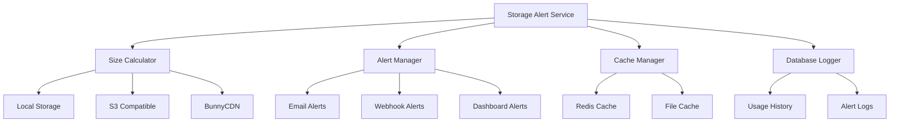

# Storage Alert System - Tài liệu tái sử dụng

## Mục lục

1. [Tổng quan](#tổng-quan)
2. [Kiến trúc hệ thống](#kiến-trúc-hệ-thống)
3. [Phân tích mã nguồn](#phân-tích-mã-nguồn)
4. [Hướng dẫn cài đặt](#hướng-dẫn-cài-đặt)
5. [Cấu hình chi tiết](#cấu-hình-chi-tiết)
6. [API Reference](#api-reference)
7. [Tùy chỉnh và mở rộng](#tùy-chỉnh-và-mở-rộng)
8. [Troubleshooting](#troubleshooting)
9. [Performance Optimization](#performance-optimization)
10. [Security Considerations](#security-considerations)
11. [Testing](#testing)
12. [Migration Guide](#migration-guide)

---

## Tổng quan

### Giới thiệu
Storage Alert System là một hệ thống toàn diện để theo dõi, quản lý và cảnh báo về dung lượng lưu trữ của website. Hệ thống hỗ trợ nhiều loại storage driver bao gồm local filesystem, Amazon S3, Wasabi, và BunnyCDN.

### Tính năng chính
- ✅ **Multi-storage support**: Local, S3, Wasabi, BunnyCDN
- ✅ **Real-time monitoring**: Theo dõi dung lượng thời gian thực
- ✅ **Smart caching**: Tối ưu hiệu suất với Redis/File cache
- ✅ **Flexible alerting**: Cảnh báo qua email, SMS, webhook
- ✅ **Multi-tenant**: Hỗ trợ nhiều tenant/domain
- ✅ **Package management**: Quản lý gói dịch vụ và quota
- ✅ **Historical tracking**: Lưu trữ lịch sử sử dụng
- ✅ **API-first design**: RESTful API đầy đủ
- ✅ **Dashboard UI**: Giao diện quản trị trực quan

### Yêu cầu hệ thống
- **PHP**: >= 8.1
- **Laravel**: >= 9.0
- **Cache Driver**: Redis (khuyến nghị) hoặc File
- **Database**: MySQL >= 8.0, PostgreSQL >= 12, SQLite >= 3.35
- **Extensions**: `ext-curl`, `ext-json`, `ext-fileinfo`, `ext-gd`

### Kiến trúc hệ thống



---

## Phân tích mã nguồn

### 1. SystemManagement::calculateStorageSize()
**Vị trí:** `packages/sudo-base/base/src/Supports/SystemManagement.php`
**Mục đích:** Tính toán và phân tích trạng thái storage

#### Chi tiết implementation:

```php
/**
 * Tính toán trạng thái storage và các cảnh báo
 * 
 * @param int $size Dung lượng hiện tại (bytes)
 * @return array Thông tin trạng thái storage
 */
public static function calculateStorageSize(int $size): array
{
    // Lấy cấu hình từ database
    $data = getOption('theme_validate', 'all', false);
    $storage = $data['storage_capacity'] ?? 0;
    $storageAdditional = $data['storage_additional'] ?? [];
    
    // Xác định giới hạn storage theo gói dịch vụ
    if (!$storage) {
        $storage = match ($data['package']) {
            'vip'      => 4294967296, // 4GB
            'vip_base' => 2147483648, // 2GB
            'base'     => 2147483648, // 2GB
            'pro'      => 4294967296, // 4GB
            'vip_pro'  => 4294967296, // 4GB
            default    => 1073741824  // 1GB
        };
    }
    
    // Khởi tạo các biến trạng thái
    $fullStorage = false;
    $warningStore = false;
    $warningStoreAddition = false;
    $statusTimeStoreAddition = false;
    $additionInformation = [];
    
    // Xử lý storage bổ sung
    if (($storageAdditional['storage_capacity'] ?? 0) && !empty($storageAdditional['addition_end_time'])) {
        $additionStartTime = date('Y-m-d', strtotime($storageAdditional['addition_start_time'] ?? date('Y-m-d')));
        $additionEndTime = date('Y-m-d', strtotime($storageAdditional['addition_end_time']));
        
        // Kiểm tra thời hạn storage bổ sung
        if ($additionEndTime < date('Y-m-d')) {
            $statusTimeStoreAddition = true;
        } else {
            // Cảnh báo trước 15 ngày khi hết hạn
            $diff = (strtotime($additionEndTime) - strtotime(date('Y-m-d'))) / (60 * 60 * 24);
            $warningStoreAddition = $diff <= 15;
            
            if (!$statusTimeStoreAddition) {
                $storage += $storageAdditional['storage_capacity'] ?? 0;
            }
        }
        
        $additionInformation = [
            'storage_size' => BaseHelper::humanFilesize($storageAdditional['storage_capacity']),
            'start_time' => $additionStartTime,
            'end_time' => $additionEndTime,
            'status_time' => $statusTimeStoreAddition,
            'alert_15_day' => $warningStoreAddition
        ];
    }
    
    // Kiểm tra trạng thái storage
    if ($storage <= $size) {
        $fullStorage = true;
    }
    
    // Cảnh báo khi sử dụng > 90%
    if (!$fullStorage && $size > $storage * 0.9) {
        $warningStore = true;
    }
    
    return compact(
        'storage', 
        'fullStorage', 
        'warningStore', 
        'additionInformation', 
        'statusTimeStoreAddition', 
        'warningStoreAddition'
    );
}
```

#### Các trạng thái trả về:

| Tham số | Kiểu | Mô tả |
|---------|------|-------|
| `storage` | int | Tổng dung lượng cho phép (bytes) |
| `fullStorage` | bool | Storage đã đầy (≥ 100%) |
| `warningStore` | bool | Storage gần đầy (≥ 90%) |
| `additionInformation` | array | Thông tin storage bổ sung |
| `statusTimeStoreAddition` | bool | Storage bổ sung đã hết hạn |
| `warningStoreAddition` | bool | Storage bổ sung sắp hết hạn (≤ 15 ngày) |

### 2. RvMedia::getSizeMediaBucket()
**Vị trí:** `packages/sudo-base/media/src/RvMedia.php`
**Mục đích:** Tính toán kích thước thực tế của media storage

#### Chi tiết implementation:

```php
/**
 * Tính toán kích thước media bucket
 * Hỗ trợ local storage, S3, Wasabi, BunnyCDN
 * 
 * @return int Kích thước storage (bytes)
 */
public function getSizeMediaBucket(): int
{
    $settingStore = app(SettingStore::class);
    $cacheKey = 'media_size_calculator';
    
    // Kiểm tra cache
    $size = $settingStore->get($cacheKey, 0);
    if ($size) {
        return $size;
    }
    
    $size = 0;
    $driver = $this->getMediaDriver();
    
    try {
        if ($driver === 'local') {
            // Tính toán cho local storage
            $size = SystemManagement::getMediaSizeFast();
        } else {
            // Tính toán cho cloud storage
            $config = config('filesystems.disks.' . $driver);
            
            switch ($driver) {
                case 'bunnycdn':
                    $size = $this->calculateBunnyCDNSize($config);
                    break;
                    
                case 's3':
                case 'wasabi':
                    $size = $this->calculateS3Size($config, $driver);
                    break;
                    
                default:
                    Log::warning("Unsupported storage driver: {$driver}");
                    $size = 0;
            }
        }
    } catch (\Exception $e) {
        Log::error("Failed to calculate media size: " . $e->getMessage(), [
            'driver' => $driver,
            'exception' => $e
        ]);
        $size = -1; // Indicate error
    }
    
    // Cache kết quả (24 giờ)
    $settingStore->set($cacheKey, $size);
    $settingStore->save();
    
    return max(0, $size); // Đảm bảo không trả về số âm
}

/**
 * Tính toán kích thước BunnyCDN
 */
private function calculateBunnyCDNSize(array $config): int
{
    $bunnyCDNClient = new BunnyCDNClient(
        $config['storage_zone'],
        $config['api_key'],
        $config['region']
    );
    
    return $bunnyCDNClient->calculateStorageSize('/');
}

/**
 * Tính toán kích thước S3/Wasabi
 */
private function calculateS3Size(array $config, string $driver): int
{
    // Cấu hình endpoint cho Wasabi
    if ($driver === 'wasabi') {
        $config['endpoint'] = 'https://' . $config['bucket'] . '.s3.' . $config['region'] . '.wasabisys.com/';
    }
    
    $s3Client = new S3Client([
        'region'  => $config['region'],
        'endpoint'  => $config['endpoint'] ?? null,
        'version' => 'latest',
        'credentials' => [
            'key'    => $config['key'],
            'secret' => $config['secret'],
        ],
    ]);

    $bucket = $config['bucket'];
    $size = 0;
    
    try {
        $paginator = $s3Client->getPaginator('ListObjectsV2', [
            'Bucket' => $bucket
        ]);
        
        foreach ($paginator as $result) {
            foreach ($result['Contents'] ?? [] as $object) {
                $size += $object['Size'];
            }
        }
    } catch (AwsException $e) {
        Log::error("S3 calculation error: " . $e->getMessage());
        throw $e;
    }
    
    return $size;
}
```

### 3. RvMedia::alertStorageSize()
**Vị trí:** `packages/sudo-base/media/src/RvMedia.php`
**Mục đích:** Tổng hợp thông tin và tạo cảnh báo storage

#### Chi tiết implementation:

```php
/**
 * Tạo thông tin cảnh báo storage
 * 
 * @return array Thông tin đầy đủ về trạng thái storage
 */
public function alertStorageSize(): array
{
    // Kiểm tra tính năng có được kích hoạt
    if (!config('sudo_media.enabled_calculator_app_size', false)) {
        return ['full_storage' => false];
    }
    
    // Lấy kích thước hiện tại (có cache)
    $size = Cache::rememberForever('storage_size', function() {
        return $this->getSizeMediaBucket();
    });
    
    // Tính toán trạng thái storage
    $storageSize = SystemManagement::calculateStorageSize($size);
    
    // Tạo response đầy đủ
    $result = [
        // Thông tin cơ bản
        'full_storage' => $storageSize['fullStorage'],
        'warning_storage' => $storageSize['warningStore'],
        'size_format' => BaseHelper::humanFilesize($size),
        'size_bytes' => $size,
        'limit_bytes' => $storageSize['storage'],
        'limit_format' => BaseHelper::humanFilesize($storageSize['storage']),
        'usage_percentage' => round(($size / $storageSize['storage']) * 100, 2),
        
        // Thông tin storage bổ sung
        'addition_storage' => $storageSize['additionInformation'],
        'warning_15_day_addition' => $storageSize['warningStoreAddition'] ?? false,
        
        // Messages
        'message' => '',
        'message_text' => '',
        'warning_message' => '',
        'warning_15_day_addition_message' => '',
        
        // Metadata
        'last_calculated' => now()->toISOString(),
        'driver' => $this->getMediaDriver(),
    ];
    
    // Tạo messages dựa trên trạng thái
    if ($storageSize['fullStorage']) {
        $result['message'] = trans('media::media.alert_storage', [
            'storage' => $result['size_format'],
            'maxStorage' => $result['limit_format']
        ]);
        $result['message_text'] = trans('media::media.alert_storage_text', [
            'storage' => $result['size_format'],
            'maxStorage' => $result['limit_format']
        ]);
    }
    
    if ($storageSize['warningStore']) {
        $result['warning_message'] = trans('media::media.warning_storage', [
            'storage' => $result['size_format'],
            'maxStorage' => $result['limit_format']
        ]);
    }
    
    if ($storageSize['warningStoreAddition'] ?? false) {
        $additionInfo = $storageSize['additionInformation'];
        $result['warning_15_day_addition_message'] = trans('media::media.alert_storage_before_date', [
            'storage' => $result['size_format'],
            'maxStorage' => $result['limit_format'],
            'date' => $additionInfo['end_time'] ?? '',
            'data' => $additionInfo['storage_size'] ?? ''
        ]);
    }
    
    return $result;
}
```

### 4. SystemManagement Storage Utilities

#### getMediaSizeFast() - Tính toán nhanh cho local storage

```php
/**
 * Tính toán nhanh kích thước media sử dụng shell command
 * Fallback về PHP nếu shell command thất bại
 * 
 * @param bool $useCache Sử dụng cache hay không
 * @return int Kích thước (bytes)
 */
public static function getMediaSizeFast(bool $useCache = true): int
{
    $cacheKey = 'media_size_fast_' . md5(public_path());
    
    if ($useCache && Cache::has($cacheKey)) {
        return Cache::get($cacheKey);
    }

    $size = 0;
    $basePath = public_path();
    
    // Sử dụng shell command cho Unix/Linux/macOS
    if (function_exists('shell_exec') && PHP_OS_FAMILY !== 'Windows') {
        $excludePatterns = [
            '--exclude=vendor',
            '--exclude=build', 
            '--exclude=assets',
        ];
        
        $command = sprintf(
            'du -sb %s %s 2>/dev/null | cut -f1',
            implode(' ', $excludePatterns),
            escapeshellarg($basePath)
        );
        
        $output = shell_exec($command);
        if ($output !== null && is_numeric(trim($output))) {
            $size = (int) trim($output);
        }
    }
    
    // Fallback về PHP method
    if ($size === 0) {
        $size = self::calculateMediaSize($basePath);
    }
    
    if ($useCache) {
        Cache::put($cacheKey, $size, 86400); // Cache 24 giờ
    }
    
    return $size;
}

/**
 * Tính toán kích thước media bằng PHP (fallback)
 */
protected static function calculateMediaSize(string $directory, int $maxDepth = 10, int $currentDepth = 0): int
{
    if ($currentDepth >= $maxDepth) {
        return 0;
    }

    $size = 0;
    $excludeDirs = ['vendor', 'build', 'assets'];

    try {
        $iterator = new \DirectoryIterator($directory);
        
        foreach ($iterator as $fileInfo) {
            if ($fileInfo->isDot()) {
                continue;
            }

            $relativePath = str_replace(public_path() . '/', '', $fileInfo->getPathname());

            // Skip excluded directories
            foreach ($excludeDirs as $excludeDir) {
                if (str_starts_with($relativePath, $excludeDir)) {
                    continue 2;
                }
            }

            if ($fileInfo->isFile()) {
                $size += $fileInfo->getSize();
            } elseif ($fileInfo->isDir()) {
                $size += self::calculateMediaSize($fileInfo->getPathname(), $maxDepth, $currentDepth + 1);
            }
        }
    } catch (\Exception $e) {
        Log::warning('Failed to calculate directory media size: ' . $e->getMessage());
    }

    return $size;
}
```

---

## Hướng dẫn cài đặt

### Bước 1: Chuẩn bị môi trường

#### 1.1. Kiểm tra yêu cầu hệ thống

```bash
# Kiểm tra PHP version
php --version

# Kiểm tra extensions
php -m | grep -E "(curl|json|fileinfo|gd)"

# Kiểm tra Laravel version
php artisan --version
```

#### 1.2. Cài đặt dependencies

```bash
# Cài đặt qua Composer
composer require aws/aws-sdk-php
composer require intervention/image
composer require league/flysystem-aws-s3-v3

# Nếu sử dụng BunnyCDN
composer require platinumwrist/flysystem-bunnycdn

# Development dependencies
composer require --dev phpunit/phpunit
composer require --dev mockery/mockery
```

### Bước 2: Tạo cấu trúc file

#### 2.1. Tạo thư mục dự án

```bash
mkdir -p app/Services/Storage
mkdir -p app/Http/Middleware
mkdir -p app/Console/Commands
mkdir -p app/Mail
mkdir -p config
mkdir -p database/migrations
mkdir -p resources/views/components
mkdir -p tests/Feature/Storage
mkdir -p tests/Unit/Storage
```

#### 2.2. Copy các file cần thiết

```bash
# Copy core files từ dự án gốc
cp packages/sudo-base/base/src/Supports/SystemManagement.php app/Services/Storage/
cp packages/sudo-base/media/src/RvMedia.php app/Services/Storage/

# Hoặc tạo mới theo template dưới đây
```

### Bước 3: Tạo các file cấu hình

#### 3.1. Config file chính

**File:** `config/storage_alert.php`

```php
<?php

return [
    /*
    |--------------------------------------------------------------------------
    | Storage Alert Configuration
    |--------------------------------------------------------------------------
    */

    // Kích hoạt tính năng storage alert
    'enabled' => env('STORAGE_ALERT_ENABLED', true),

    // Driver cache cho storage calculation
    'cache_driver' => env('STORAGE_CACHE_DRIVER', 'redis'),

    // Thời gian cache (seconds)
    'cache_duration' => env('STORAGE_CACHE_DURATION', 3600),

    // Ngưỡng cảnh báo (90%)
    'warning_threshold' => env('STORAGE_WARNING_THRESHOLD', 0.9),

    // Cảnh báo trước khi hết hạn (days)
    'expiry_warning_days' => env('STORAGE_EXPIRY_WARNING_DAYS', 15),

    /*
    |--------------------------------------------------------------------------
    | Storage Packages
    |--------------------------------------------------------------------------
    */
    'packages' => [
        'basic'    => [
            'storage' => 1073741824,   // 1GB
            'name' => 'Basic Plan',
            'features' => ['basic_support']
        ],
        'pro'      => [
            'storage' => 2147483648,   // 2GB  
            'name' => 'Pro Plan',
            'features' => ['priority_support', 'advanced_features']
        ],
        'business' => [
            'storage' => 4294967296,   // 4GB
            'name' => 'Business Plan', 
            'features' => ['24x7_support', 'custom_features', 'api_access']
        ],
        'enterprise' => [
            'storage' => 10737418240,  // 10GB
            'name' => 'Enterprise Plan',
            'features' => ['dedicated_support', 'unlimited_features', 'custom_integration']
        ]
    ],

    /*
    |--------------------------------------------------------------------------
    | Storage Drivers
    |--------------------------------------------------------------------------
    */
    'supported_drivers' => [
        'local' => [
            'name' => 'Local Storage',
            'calculator' => 'fast_shell'  // 'fast_shell' or 'recursive_php'
        ],
        's3' => [
            'name' => 'Amazon S3',
            'calculator' => 'api_paginated'
        ],
        'wasabi' => [
            'name' => 'Wasabi Cloud Storage',
            'calculator' => 'api_paginated'
        ],
        'bunnycdn' => [
            'name' => 'BunnyCDN',
            'calculator' => 'api_direct'
        ]
    ],

    /*
    |--------------------------------------------------------------------------
    | Alert Channels
    |--------------------------------------------------------------------------
    */
    'alert_channels' => [
        'email' => [
            'enabled' => env('STORAGE_ALERT_EMAIL_ENABLED', true),
            'recipients' => env('STORAGE_ALERT_EMAIL_RECIPIENTS', 'admin@example.com'),
            'templates' => [
                'warning' => 'emails.storage.warning',
                'full' => 'emails.storage.full',
                'expiring' => 'emails.storage.expiring'
            ]
        ],
        'webhook' => [
            'enabled' => env('STORAGE_ALERT_WEBHOOK_ENABLED', false),
            'url' => env('STORAGE_ALERT_WEBHOOK_URL'),
            'secret' => env('STORAGE_ALERT_WEBHOOK_SECRET'),
            'retry_attempts' => 3
        ],
        'slack' => [
            'enabled' => env('STORAGE_ALERT_SLACK_ENABLED', false),
            'webhook_url' => env('STORAGE_ALERT_SLACK_WEBHOOK'),
            'channel' => env('STORAGE_ALERT_SLACK_CHANNEL', '#alerts'),
            'username' => 'Storage Monitor'
        ]
    ],

    /*
    |--------------------------------------------------------------------------
    | Calculation Settings
    |--------------------------------------------------------------------------
    */
    'calculation' => [
        // Thư mục loại trừ cho local storage
        'exclude_directories' => [
            'vendor',
            'node_modules',
            'storage/logs',
            'storage/framework/cache',
            'storage/framework/sessions', 
            'storage/framework/views',
            '.git',
            'bootstrap/cache',
            'build',
            'assets'
        ],
        
        // Độ sâu tối đa khi scan thư mục
        'max_depth' => 10,
        
        // Timeout cho API calls (seconds)
        'api_timeout' => 30,
        
        // Batch size cho S3 pagination
        's3_batch_size' => 1000
    ],

    /*
    |--------------------------------------------------------------------------
    | Multi-tenant Settings
    |--------------------------------------------------------------------------
    */
    'multi_tenant' => [
        'enabled' => env('STORAGE_MULTI_TENANT_ENABLED', false),
        'tenant_column' => 'tenant_id',
        'default_package' => 'basic'
    ],

    /*
    |--------------------------------------------------------------------------
    | Monitoring & Logging
    |--------------------------------------------------------------------------
    */
    'monitoring' => [
        // Log storage calculations
        'log_calculations' => env('STORAGE_LOG_CALCULATIONS', true),
        
        // Log level
        'log_level' => env('STORAGE_LOG_LEVEL', 'info'),
        
        // Keep history for X days
        'history_retention_days' => env('STORAGE_HISTORY_RETENTION', 90),
        
        // Performance monitoring
        'performance_monitoring' => env('STORAGE_PERFORMANCE_MONITORING', true)
    ]
];
```

#### 3.2. Environment Configuration

**File:** `.env` (thêm vào file .env hiện tại)

```env
# Storage Alert Settings
STORAGE_ALERT_ENABLED=true
STORAGE_CACHE_DRIVER=redis
STORAGE_CACHE_DURATION=3600
STORAGE_WARNING_THRESHOLD=0.9
STORAGE_EXPIRY_WARNING_DAYS=15

# Default Package
STORAGE_DEFAULT_PACKAGE=basic

# Alert Channels
STORAGE_ALERT_EMAIL_ENABLED=true
STORAGE_ALERT_EMAIL_RECIPIENTS=admin@yourdomain.com
STORAGE_ALERT_WEBHOOK_ENABLED=false
STORAGE_ALERT_WEBHOOK_URL=
STORAGE_ALERT_SLACK_ENABLED=false
STORAGE_ALERT_SLACK_WEBHOOK=

# Performance Settings
STORAGE_LOG_CALCULATIONS=true
STORAGE_LOG_LEVEL=info
STORAGE_PERFORMANCE_MONITORING=true
STORAGE_HISTORY_RETENTION=90

# Multi-tenant (nếu cần)
STORAGE_MULTI_TENANT_ENABLED=false
```

### Bước 4: Tạo Migration

**File:** `database/migrations/xxxx_xx_xx_create_storage_monitoring_tables.php`

```php
<?php

use Illuminate\Database\Migrations\Migration;
use Illuminate\Database\Schema\Blueprint;
use Illuminate\Support\Facades\Schema;

return new class extends Migration
{
    /**
     * Run the migrations.
     */
    public function up(): void
    {
        // Bảng lưu trữ thông tin gói dịch vụ
        Schema::create('storage_packages', function (Blueprint $table) {
            $table->id();
            $table->string('name')->unique();
            $table->string('display_name');
            $table->bigInteger('storage_limit'); // bytes
            $table->json('features')->nullable();
            $table->decimal('price', 10, 2)->default(0);
            $table->string('billing_cycle')->default('monthly'); // monthly, yearly
            $table->boolean('is_active')->default(true);
            $table->timestamps();
            
            $table->index(['is_active']);
        });

        // Bảng lưu trữ thông tin storage của từng user/tenant
        Schema::create('storage_quotas', function (Blueprint $table) {
            $table->id();
            $table->unsignedBigInteger('user_id')->nullable();
            $table->string('tenant_id')->nullable();
            $table->foreignId('package_id')->constrained('storage_packages');
            $table->bigInteger('storage_limit'); // bytes
            $table->bigInteger('additional_storage')->default(0); // bytes
            $table->timestamp('additional_expires_at')->nullable();
            $table->timestamp('package_expires_at')->nullable();
            $table->boolean('is_active')->default(true);
            $table->json('metadata')->nullable();
            $table->timestamps();

            $table->index(['user_id', 'is_active']);
            $table->index(['tenant_id', 'is_active']);
            $table->index(['package_expires_at']);
            $table->index(['additional_expires_at']);
        });

        // Bảng lưu trữ lịch sử sử dụng storage
        Schema::create('storage_usage_history', function (Blueprint $table) {
            $table->id();
            $table->unsignedBigInteger('user_id')->nullable();
            $table->string('tenant_id')->nullable();
            $table->bigInteger('used_storage'); // bytes
            $table->bigInteger('storage_limit'); // bytes
            $table->decimal('usage_percentage', 5, 2);
            $table->string('driver')->default('local');
            $table->integer('calculation_duration_ms')->nullable(); // performance tracking
            $table->timestamp('calculated_at');
            $table->json('metadata')->nullable();

            $table->index(['user_id', 'calculated_at']);
            $table->index(['tenant_id', 'calculated_at']);
            $table->index(['calculated_at']);
            $table->index(['usage_percentage']);
        });

        // Bảng lưu trữ log cảnh báo
        Schema::create('storage_alert_logs', function (Blueprint $table) {
            $table->id();
            $table->unsignedBigInteger('user_id')->nullable();
            $table->string('tenant_id')->nullable();
            $table->string('alert_type'); // warning, full, expiring
            $table->string('channel'); // email, webhook, slack
            $table->bigInteger('used_storage'); // bytes
            $table->bigInteger('storage_limit'); // bytes
            $table->text('message');
            $table->json('alert_data')->nullable();
            $table->timestamp('sent_at');
            $table->boolean('is_successful')->default(true);
            $table->text('error_message')->nullable();

            $table->index(['user_id', 'alert_type']);
            $table->index(['tenant_id', 'alert_type']);
            $table->index(['sent_at']);
            $table->index(['alert_type', 'is_successful']);
        });

        // Bảng cache tính toán storage
        Schema::create('storage_calculations_cache', function (Blueprint $table) {
            $table->id();
            $table->string('cache_key')->unique();
            $table->unsignedBigInteger('user_id')->nullable();
            $table->string('tenant_id')->nullable();
            $table->bigInteger('calculated_size'); // bytes
            $table->string('driver');
            $table->integer('calculation_duration_ms');
            $table->timestamp('calculated_at');
            $table->timestamp('expires_at');
            $table->json('metadata')->nullable();

            $table->index(['cache_key', 'expires_at']);
            $table->index(['user_id', 'expires_at']);
            $table->index(['tenant_id', 'expires_at']);
        });
    }

    /**
     * Reverse the migrations.
     */
    public function down(): void
    {
        Schema::dropIfExists('storage_calculations_cache');
        Schema::dropIfExists('storage_alert_logs');
        Schema::dropIfExists('storage_usage_history');
        Schema::dropIfExists('storage_quotas');
        Schema::dropIfExists('storage_packages');
    }
};
```

### Bước 5: Tạo Models

#### 5.1. StoragePackage Model

**File:** `app/Models/StoragePackage.php`

```php
<?php

namespace App\Models;

use Illuminate\Database\Eloquent\Model;
use Illuminate\Database\Eloquent\Relations\HasMany;

class StoragePackage extends Model
{
    protected $fillable = [
        'name',
        'display_name',
        'storage_limit',
        'features',
        'price',
        'billing_cycle',
        'is_active'
    ];

    protected $casts = [
        'features' => 'array',
        'storage_limit' => 'integer',
        'price' => 'decimal:2',
        'is_active' => 'boolean'
    ];

    public function quotas(): HasMany
    {
        return $this->hasMany(StorageQuota::class, 'package_id');
    }

    public function getFormattedStorageLimitAttribute(): string
    {
        return $this->formatBytes($this->storage_limit);
    }

    private function formatBytes(int $bytes): string
    {
        $units = ['B', 'KB', 'MB', 'GB', 'TB'];
        for ($i = 0; $bytes >= 1024 && $i < count($units) - 1; $i++) {
            $bytes /= 1024;
        }
        return round($bytes, 2) . ' ' . $units[$i];
    }
}
```

#### 5.2. StorageQuota Model

**File:** `app/Models/StorageQuota.php`

```php
<?php

namespace App\Models;

use Illuminate\Database\Eloquent\Model;
use Illuminate\Database\Eloquent\Relations\BelongsTo;
use Illuminate\Database\Eloquent\Relations\HasMany;
use Carbon\Carbon;

class StorageQuota extends Model
{
    protected $fillable = [
        'user_id',
        'tenant_id', 
        'package_id',
        'storage_limit',
        'additional_storage',
        'additional_expires_at',
        'package_expires_at',
        'is_active',
        'metadata'
    ];

    protected $casts = [
        'storage_limit' => 'integer',
        'additional_storage' => 'integer',
        'additional_expires_at' => 'datetime',
        'package_expires_at' => 'datetime',
        'is_active' => 'boolean',
        'metadata' => 'array'
    ];

    public function package(): BelongsTo
    {
        return $this->belongsTo(StoragePackage::class, 'package_id');
    }

    public function usageHistory(): HasMany
    {
        return $this->hasMany(StorageUsageHistory::class, 'user_id', 'user_id');
    }

    public function getTotalStorageLimitAttribute(): int
    {
        $baseLimit = $this->storage_limit;
        
        // Thêm additional storage nếu chưa hết hạn
        if ($this->additional_storage && 
            $this->additional_expires_at && 
            $this->additional_expires_at->isFuture()) {
            $baseLimit += $this->additional_storage;
        }
        
        return $baseLimit;
    }

    public function isAdditionalStorageExpiring(int $days = 15): bool
    {
        if (!$this->additional_expires_at) {
            return false;
        }

        return $this->additional_expires_at->diffInDays(Carbon::now()) <= $days;
    }

    public function isPackageExpiring(int $days = 15): bool
    {
        if (!$this->package_expires_at) {
            return false;
        }

        return $this->package_expires_at->diffInDays(Carbon::now()) <= $days;
    }

    public function scopeActive($query)
    {
        return $query->where('is_active', true);
    }

    public function scopeForUser($query, $userId)
    {
        return $query->where('user_id', $userId);
    }

    public function scopeForTenant($query, $tenantId)
    {
        return $query->where('tenant_id', $tenantId);
    }
}
```

#### 5.3. StorageUsageHistory Model

**File:** `app/Models/StorageUsageHistory.php`

```php
<?php

namespace App\Models;

use Illuminate\Database\Eloquent\Model;

class StorageUsageHistory extends Model
{
    protected $table = 'storage_usage_history';
    
    protected $fillable = [
        'user_id',
        'tenant_id',
        'used_storage',
        'storage_limit',
        'usage_percentage',
        'driver',
        'calculation_duration_ms',
        'calculated_at',
        'metadata'
    ];

    protected $casts = [
        'used_storage' => 'integer',
        'storage_limit' => 'integer',
        'usage_percentage' => 'decimal:2',
        'calculation_duration_ms' => 'integer',
        'calculated_at' => 'datetime',
        'metadata' => 'array'
    ];

    public function getFormattedUsedStorageAttribute(): string
    {
        return $this->formatBytes($this->used_storage);
    }

    public function getFormattedStorageLimitAttribute(): string
    {
        return $this->formatBytes($this->storage_limit);
    }

    private function formatBytes(int $bytes): string
    {
        $units = ['B', 'KB', 'MB', 'GB', 'TB'];
        for ($i = 0; $bytes >= 1024 && $i < count($units) - 1; $i++) {
            $bytes /= 1024;
        }
        return round($bytes, 2) . ' ' . $units[$i];
    }

    public function scopeForUser($query, $userId)
    {
        return $query->where('user_id', $userId);
    }

    public function scopeForTenant($query, $tenantId)
    {
        return $query->where('tenant_id', $tenantId);
    }

    public function scopeRecentFirst($query)
    {
        return $query->orderBy('calculated_at', 'desc');
    }
}
```

---

## Cấu hình chi tiết

### Service Provider Registration

**File:** `app/Providers/StorageAlertServiceProvider.php`

```php
<?php

namespace App\Providers;

use Illuminate\Support\ServiceProvider;
use App\Services\Storage\StorageAlertService;
use App\Services\Storage\StorageCalculatorInterface;
use App\Services\Storage\Calculators\LocalStorageCalculator;
use App\Services\Storage\Calculators\S3StorageCalculator;
use App\Services\Storage\Calculators\BunnyCDNStorageCalculator;

class StorageAlertServiceProvider extends ServiceProvider
{
    /**
     * Register services.
     */
    public function register(): void
    {
        // Bind main service
        $this->app->singleton(StorageAlertService::class);

        // Bind calculators
        $this->app->bind('storage.calculator.local', LocalStorageCalculator::class);
        $this->app->bind('storage.calculator.s3', S3StorageCalculator::class);
        $this->app->bind('storage.calculator.wasabi', S3StorageCalculator::class);
        $this->app->bind('storage.calculator.bunnycdn', BunnyCDNStorageCalculator::class);

        // Merge config
        $this->mergeConfigFrom(
            __DIR__.'/../../config/storage_alert.php', 'storage_alert'
        );
    }

    /**
     * Bootstrap services.
     */
    public function boot(): void
    {
        // Publish config
        $this->publishes([
            __DIR__.'/../../config/storage_alert.php' => config_path('storage_alert.php'),
        ], 'storage-alert-config');

        // Publish migrations
        $this->publishes([
            __DIR__.'/../../database/migrations/' => database_path('migrations'),
        ], 'storage-alert-migrations');

        // Publish views
        $this->publishes([
            __DIR__.'/../../resources/views/' => resource_path('views'),
        ], 'storage-alert-views');

        // Load migrations
        $this->loadMigrationsFrom(__DIR__.'/../../database/migrations');

        // Load views
        $this->loadViewsFrom(__DIR__.'/../../resources/views', 'storage-alert');

        // Register commands
        if ($this->app->runningInConsole()) {
            $this->commands([
                \App\Console\Commands\StorageCalculateCommand::class,
                \App\Console\Commands\StorageCleanupCommand::class,
                \App\Console\Commands\StorageReportCommand::class,
            ]);
        }
    }
}
```

**Đăng ký trong:** `config/app.php`

```php
'providers' => [
    // Other Service Providers...
    
    App\Providers\StorageAlertServiceProvider::class,
],
```

### Core Service Implementation

**File:** `app/Services/Storage/StorageAlertService.php`

```php
<?php

namespace App\Services\Storage;

use App\Models\StorageQuota;
use App\Models\StorageUsageHistory;
use App\Models\StorageAlertLog;
use App\Events\StorageAlertTriggered;
use App\Notifications\StorageWarningNotification;
use App\Notifications\StorageFullNotification;
use Illuminate\Support\Facades\Cache;
use Illuminate\Support\Facades\Log;
use Illuminate\Support\Facades\Notification;
use Carbon\Carbon;

class StorageAlertService
{
    private array $calculators;
    private AlertManagerService $alertManager;
    
    public function __construct(AlertManagerService $alertManager)
    {
        $this->alertManager = $alertManager;
        $this->initializeCalculators();
    }

    /**
     * Initialize storage calculators for different drivers
     */
    private function initializeCalculators(): void
    {
        $this->calculators = [
            'local' => app('storage.calculator.local'),
            's3' => app('storage.calculator.s3'),
            'wasabi' => app('storage.calculator.wasabi'),
            'bunnycdn' => app('storage.calculator.bunnycdn'),
        ];
    }

    /**
     * Calculate current storage usage
     */
    public function calculateStorageUsage($userId = null, $tenantId = null, bool $useCache = true): array
    {
        $cacheKey = $this->generateCacheKey($userId, $tenantId);
        
        if ($useCache && Cache::has($cacheKey)) {
            return Cache::get($cacheKey);
        }

        $startTime = microtime(true);
        
        try {
            // Get storage quota
            $quota = $this->getStorageQuota($userId, $tenantId);
            
            // Calculate current usage
            $driver = config('filesystems.default');
            $calculator = $this->calculators[$driver] ?? $this->calculators['local'];
            
            $usedStorage = $calculator->calculateSize($userId, $tenantId);
            $storageLimit = $quota->total_storage_limit;
            
            $result = $this->analyzeStorageUsage($usedStorage, $storageLimit, $quota);
            
            // Add metadata
            $result['metadata'] = [
                'calculation_time_ms' => round((microtime(true) - $startTime) * 1000, 2),
                'driver' => $driver,
                'calculated_at' => Carbon::now()->toISOString(),
                'cache_key' => $cacheKey
            ];
            
            // Cache result
            if ($useCache) {
                $duration = config('storage_alert.cache_duration', 3600);
                Cache::put($cacheKey, $result, $duration);
            }
            
            // Log usage history
            $this->logUsageHistory($userId, $tenantId, $result);
            
            return $result;
            
        } catch (\Exception $e) {
            Log::error('Storage calculation failed', [
                'user_id' => $userId,
                'tenant_id' => $tenantId,
                'error' => $e->getMessage(),
                'trace' => $e->getTraceAsString()
            ]);
            
            throw $e;
        }
    }

    /**
     * Analyze storage usage and generate alerts
     */
    private function analyzeStorageUsage(int $usedStorage, int $storageLimit, StorageQuota $quota): array
    {
        $usagePercentage = $storageLimit > 0 ? ($usedStorage / $storageLimit) * 100 : 0;
        $warningThreshold = config('storage_alert.warning_threshold', 0.9) * 100;
        
        $result = [
            'used_storage' => $usedStorage,
            'storage_limit' => $storageLimit,
            'usage_percentage' => round($usagePercentage, 2),
            'formatted_used' => $this->formatBytes($usedStorage),
            'formatted_limit' => $this->formatBytes($storageLimit),
            'is_warning' => $usagePercentage >= $warningThreshold,
            'is_full' => $usagePercentage >= 100,
            'status' => $this->getStorageStatus($usagePercentage),
            'quota_info' => [
                'package_name' => $quota->package->display_name,
                'base_storage' => $quota->storage_limit,
                'additional_storage' => $quota->additional_storage,
                'additional_expires_at' => $quota->additional_expires_at?->toISOString(),
                'package_expires_at' => $quota->package_expires_at?->toISOString(),
            ],
            'alerts' => [
                'storage_warning' => $usagePercentage >= $warningThreshold && $usagePercentage < 100,
                'storage_full' => $usagePercentage >= 100,
                'additional_expiring' => $quota->isAdditionalStorageExpiring(),
                'package_expiring' => $quota->isPackageExpiring(),
            ]
        ];
        
        // Generate alert messages
        $result['messages'] = $this->generateAlertMessages($result);
        
        return $result;
    }

    /**
     * Generate appropriate alert messages
     */
    private function generateAlertMessages(array $data): array
    {
        $messages = [];
        
        if ($data['alerts']['storage_full']) {
            $messages['storage_full'] = trans('storage_alert.messages.storage_full', [
                'used' => $data['formatted_used'],
                'limit' => $data['formatted_limit']
            ]);
        } elseif ($data['alerts']['storage_warning']) {
            $messages['storage_warning'] = trans('storage_alert.messages.storage_warning', [
                'used' => $data['formatted_used'],
                'limit' => $data['formatted_limit'],
                'percentage' => $data['usage_percentage']
            ]);
        }
        
        if ($data['alerts']['additional_expiring']) {
            $messages['additional_expiring'] = trans('storage_alert.messages.additional_expiring', [
                'date' => $data['quota_info']['additional_expires_at'],
                'size' => $this->formatBytes($data['quota_info']['additional_storage'])
            ]);
        }
        
        if ($data['alerts']['package_expiring']) {
            $messages['package_expiring'] = trans('storage_alert.messages.package_expiring', [
                'date' => $data['quota_info']['package_expires_at'],
                'package' => $data['quota_info']['package_name']
            ]);
        }
        
        return $messages;
    }

    /**
     * Get storage status text
     */
    private function getStorageStatus(float $percentage): string
    {
        return match (true) {
            $percentage >= 100 => 'full',
            $percentage >= 90 => 'warning',
            $percentage >= 70 => 'notice',
            default => 'ok'
        };
    }

    /**
     * Get or create storage quota for user/tenant
     */
    private function getStorageQuota($userId = null, $tenantId = null): StorageQuota
    {
        $query = StorageQuota::active();
        
        if ($userId) {
            $query->forUser($userId);
        } elseif ($tenantId) {
            $query->forTenant($tenantId);
        }
        
        $quota = $query->first();
        
        if (!$quota) {
            // Create default quota
            $defaultPackage = \App\Models\StoragePackage::where('name', config('storage_alert.default_package', 'basic'))->first();
            
            $quota = StorageQuota::create([
                'user_id' => $userId,
                'tenant_id' => $tenantId,
                'package_id' => $defaultPackage->id,
                'storage_limit' => $defaultPackage->storage_limit,
                'is_active' => true
            ]);
        }
        
        return $quota->load('package');
    }

    /**
     * Log usage history
     */
    private function logUsageHistory($userId, $tenantId, array $data): void
    {
        if (!config('storage_alert.monitoring.log_calculations', true)) {
            return;
        }
        
        StorageUsageHistory::create([
            'user_id' => $userId,
            'tenant_id' => $tenantId,
            'used_storage' => $data['used_storage'],
            'storage_limit' => $data['storage_limit'],
            'usage_percentage' => $data['usage_percentage'],
            'driver' => $data['metadata']['driver'],
            'calculation_duration_ms' => $data['metadata']['calculation_time_ms'],
            'calculated_at' => now(),
            'metadata' => $data['metadata']
        ]);
    }

    /**
     * Send alerts based on storage status
     */
    public function checkAndSendAlerts($userId = null, $tenantId = null): void
    {
        try {
            $data = $this->calculateStorageUsage($userId, $tenantId);
            
            // Check if we need to send alerts
            $alertsToSend = array_filter($data['alerts']);
            
            if (empty($alertsToSend)) {
                return;
            }
            
            foreach ($alertsToSend as $alertType => $shouldSend) {
                if ($shouldSend && $this->shouldSendAlert($alertType, $userId, $tenantId)) {
                    $this->alertManager->sendAlert($alertType, $data, $userId, $tenantId);
                }
            }
            
        } catch (\Exception $e) {
            Log::error('Alert checking failed', [
                'user_id' => $userId,
                'tenant_id' => $tenantId,
                'error' => $e->getMessage()
            ]);
        }
    }

    /**
     * Check if alert should be sent (throttling)
     */
    private function shouldSendAlert(string $alertType, $userId, $tenantId): bool
    {
        // Check if same alert was sent recently (throttling)
        $recentAlert = StorageAlertLog::where('alert_type', $alertType)
            ->when($userId, fn($q) => $q->where('user_id', $userId))
            ->when($tenantId, fn($q) => $q->where('tenant_id', $tenantId))
            ->where('sent_at', '>=', now()->subHours(24))
            ->where('is_successful', true)
            ->first();
            
        return !$recentAlert;
    }

    /**
     * Format bytes to human readable string
     */
    private function formatBytes(int $bytes): string
    {
        $units = ['B', 'KB', 'MB', 'GB', 'TB', 'PB'];
        
        for ($i = 0; $bytes >= 1024 && $i < count($units) - 1; $i++) {
            $bytes /= 1024;
        }
        
        return round($bytes, 2) . ' ' . $units[$i];
    }

    /**
     * Generate cache key
     */
    private function generateCacheKey($userId, $tenantId): string
    {
        $identifier = $userId ? "user:{$userId}" : "tenant:{$tenantId}";
        return "storage_usage:{$identifier}";
    }

    /**
     * Clear cache for specific user/tenant
     */
    public function clearCache($userId = null, $tenantId = null): void
    {
        $cacheKey = $this->generateCacheKey($userId, $tenantId);
        Cache::forget($cacheKey);
    }

    /**
     * Get storage trend data
     */
    public function getStorageTrend($userId = null, $tenantId = null, int $days = 30): array
    {
        $query = StorageUsageHistory::query()
            ->when($userId, fn($q) => $q->forUser($userId))
            ->when($tenantId, fn($q) => $q->forTenant($tenantId))
            ->where('calculated_at', '>=', now()->subDays($days))
            ->orderBy('calculated_at');
            
        $history = $query->get();
        
        return [
            'labels' => $history->pluck('calculated_at')->map(fn($date) => $date->format('Y-m-d'))->toArray(),
            'usage_data' => $history->pluck('usage_percentage')->toArray(),
            'size_data' => $history->pluck('used_storage')->toArray(),
            'avg_usage' => $history->avg('usage_percentage'),
            'max_usage' => $history->max('usage_percentage'),
            'trend' => $this->calculateTrend($history->pluck('usage_percentage')->toArray())
        ];
    }

    /**
     * Calculate trend direction
     */
    private function calculateTrend(array $data): string
    {
        if (count($data) < 2) {
            return 'stable';
        }
        
        $recent = array_slice($data, -7); // Last 7 days
        $older = array_slice($data, -14, 7); // Previous 7 days
        
        $recentAvg = array_sum($recent) / count($recent);
        $olderAvg = array_sum($older) / count($older);
        
        $diff = $recentAvg - $olderAvg;
        
        return match (true) {
            $diff > 5 => 'increasing',
            $diff < -5 => 'decreasing',
            default => 'stable'
        };
    }
}
```

### Storage Calculator Interfaces

**File:** `app/Services/Storage/StorageCalculatorInterface.php`

```php
<?php

namespace App\Services\Storage;

interface StorageCalculatorInterface
{
    /**
     * Calculate storage size for given user/tenant
     */
    public function calculateSize($userId = null, $tenantId = null): int;
    
    /**
     * Get calculator name
     */
    public function getName(): string;
    
    /**
     * Check if calculator supports given driver
     */
    public function supports(string $driver): bool;
}
```

### Local Storage Calculator

**File:** `app/Services/Storage/Calculators/LocalStorageCalculator.php`

```php
<?php

namespace App\Services\Storage\Calculators;

use App\Services\Storage\StorageCalculatorInterface;
use Illuminate\Support\Facades\File;
use Illuminate\Support\Facades\Log;

class LocalStorageCalculator implements StorageCalculatorInterface
{
    public function calculateSize($userId = null, $tenantId = null): int
    {
        $method = config('storage_alert.calculation.method', 'fast_shell');
        
        return match ($method) {
            'fast_shell' => $this->calculateSizeShell($userId, $tenantId),
            'recursive_php' => $this->calculateSizeRecursive($userId, $tenantId),
            default => $this->calculateSizeShell($userId, $tenantId)
        };
    }

    private function calculateSizeShell($userId, $tenantId): int
    {
        if (PHP_OS_FAMILY === 'Windows' || !function_exists('shell_exec')) {
            return $this->calculateSizeRecursive($userId, $tenantId);
        }

        $basePath = $this->getStoragePath($userId, $tenantId);
        $excludeDirectories = config('storage_alert.calculation.exclude_directories', []);
        
        $excludePatterns = array_map(fn($dir) => "--exclude={$dir}", $excludeDirectories);
        
        $command = sprintf(
            'du -sb %s %s 2>/dev/null | cut -f1',
            implode(' ', $excludePatterns),
            escapeshellarg($basePath)
        );
        
        $output = shell_exec($command);
        
        if ($output !== null && is_numeric(trim($output))) {
            return (int) trim($output);
        }
        
        // Fallback to PHP method
        return $this->calculateSizeRecursive($userId, $tenantId);
    }

    private function calculateSizeRecursive($userId, $tenantId): int
    {
        $basePath = $this->getStoragePath($userId, $tenantId);
        $excludeDirectories = config('storage_alert.calculation.exclude_directories', []);
        $maxDepth = config('storage_alert.calculation.max_depth', 10);
        
        return $this->calculateDirectorySize($basePath, $excludeDirectories, $maxDepth);
    }

    private function calculateDirectorySize(string $directory, array $excludeDirs, int $maxDepth, int $currentDepth = 0): int
    {
        if ($currentDepth >= $maxDepth || !is_dir($directory)) {
            return 0;
        }

        $size = 0;
        
        try {
            $iterator = new \DirectoryIterator($directory);
            
            foreach ($iterator as $fileInfo) {
                if ($fileInfo->isDot()) {
                    continue;
                }

                $relativePath = str_replace($directory . '/', '', $fileInfo->getPathname());
                
                // Check if directory should be excluded
                foreach ($excludeDirs as $excludeDir) {
                    if (str_starts_with($relativePath, $excludeDir)) {
                        continue 2;
                    }
                }

                if ($fileInfo->isFile()) {
                    $size += $fileInfo->getSize();
                } elseif ($fileInfo->isDir()) {
                    $size += $this->calculateDirectorySize(
                        $fileInfo->getPathname(), 
                        $excludeDirs, 
                        $maxDepth, 
                        $currentDepth + 1
                    );
                }
            }
        } catch (\Exception $e) {
            Log::warning('Failed to calculate directory size', [
                'directory' => $directory,
                'error' => $e->getMessage()
            ]);
        }

        return $size;
    }

    private function getStoragePath($userId, $tenantId): string
    {
        if (config('storage_alert.multi_tenant.enabled') && $tenantId) {
            return storage_path("app/tenants/{$tenantId}");
        } elseif ($userId) {
            return storage_path("app/users/{$userId}");
        } else {
            return storage_path('app/public');
        }
    }

    public function getName(): string
    {
        return 'Local Storage Calculator';
    }

    public function supports(string $driver): bool
    {
        return $driver === 'local';
    }
}
```

### S3 Storage Calculator

**File:** `app/Services/Storage/Calculators/S3StorageCalculator.php`

```php
<?php

namespace App\Services\Storage\Calculators;

use App\Services\Storage\StorageCalculatorInterface;
use Aws\S3\S3Client;
use Aws\Exception\AwsException;
use Illuminate\Support\Facades\Log;

class S3StorageCalculator implements StorageCalculatorInterface
{
    public function calculateSize($userId = null, $tenantId = null): int
    {
        $driver = config('filesystems.default');
        $config = config("filesystems.disks.{$driver}");
        
        if (!$config) {
            throw new \InvalidArgumentException("Storage configuration not found for driver: {$driver}");
        }

        // Configure endpoint for Wasabi
        if ($driver === 'wasabi') {
            $config['endpoint'] = "https://{$config['bucket']}.s3.{$config['region']}.wasabisys.com/";
        }

        $s3Client = new S3Client([
            'region' => $config['region'],
            'endpoint' => $config['endpoint'] ?? null,
            'version' => 'latest',
            'credentials' => [
                'key' => $config['key'],
                'secret' => $config['secret'],
            ],
        ]);

        return $this->calculateBucketSize($s3Client, $config['bucket'], $userId, $tenantId);
    }

    private function calculateBucketSize(S3Client $s3Client, string $bucket, $userId, $tenantId): int
    {
        $size = 0;
        $prefix = $this->getPrefix($userId, $tenantId);
        
        try {
            $paginator = $s3Client->getPaginator('ListObjectsV2', [
                'Bucket' => $bucket,
                'Prefix' => $prefix,
                'MaxKeys' => config('storage_alert.calculation.s3_batch_size', 1000)
            ]);

            foreach ($paginator as $result) {
                foreach ($result['Contents'] ?? [] as $object) {
                    $size += $object['Size'];
                }
            }
        } catch (AwsException $e) {
            Log::error('S3 storage calculation failed', [
                'bucket' => $bucket,
                'prefix' => $prefix,
                'error' => $e->getMessage()
            ]);
            throw $e;
        }

        return $size;
    }

    private function getPrefix($userId, $tenantId): string
    {
        if (config('storage_alert.multi_tenant.enabled') && $tenantId) {
            return "tenants/{$tenantId}/";
        } elseif ($userId) {
            return "users/{$userId}/";
        } else {
            return '';
        }
    }

    public function getName(): string
    {
        return 'S3 Storage Calculator';
    }

    public function supports(string $driver): bool
    {
        return in_array($driver, ['s3', 'wasabi']);
    }
}
```

### Alert Manager Service

**File:** `app/Services/Storage/AlertManagerService.php`

```php
<?php

namespace App\Services\Storage;

use App\Models\StorageAlertLog;
use App\Models\User;
use App\Notifications\StorageAlertNotification;
use Illuminate\Support\Facades\Log;
use Illuminate\Support\Facades\Http;
use Illuminate\Support\Facades\Mail;
use Illuminate\Support\Facades\Notification;

class AlertManagerService
{
    public function sendAlert(string $alertType, array $data, $userId = null, $tenantId = null): void
    {
        $channels = $this->getEnabledChannels();
        
        foreach ($channels as $channel) {
            try {
                $this->sendAlertViaChannel($channel, $alertType, $data, $userId, $tenantId);
                
                $this->logAlert($alertType, $channel, $data, $userId, $tenantId, true);
                
            } catch (\Exception $e) {
                Log::error("Failed to send {$alertType} alert via {$channel}", [
                    'user_id' => $userId,
                    'tenant_id' => $tenantId,
                    'error' => $e->getMessage()
                ]);
                
                $this->logAlert($alertType, $channel, $data, $userId, $tenantId, false, $e->getMessage());
            }
        }
    }

    private function sendAlertViaChannel(string $channel, string $alertType, array $data, $userId, $tenantId): void
    {
        switch ($channel) {
            case 'email':
                $this->sendEmailAlert($alertType, $data, $userId, $tenantId);
                break;
            case 'webhook':
                $this->sendWebhookAlert($alertType, $data, $userId, $tenantId);
                break;
            case 'slack':
                $this->sendSlackAlert($alertType, $data, $userId, $tenantId);
                break;
        }
    }

    private function sendEmailAlert(string $alertType, array $data, $userId, $tenantId): void
    {
        $recipients = $this->getEmailRecipients($userId, $tenantId);
        
        foreach ($recipients as $recipient) {
            Notification::route('mail', $recipient)
                ->notify(new StorageAlertNotification($alertType, $data));
        }
    }

    private function sendWebhookAlert(string $alertType, array $data, $userId, $tenantId): void
    {
        $webhookUrl = config('storage_alert.alert_channels.webhook.url');
        $secret = config('storage_alert.alert_channels.webhook.secret');
        
        if (!$webhookUrl) {
            return;
        }

        $payload = [
            'alert_type' => $alertType,
            'user_id' => $userId,
            'tenant_id' => $tenantId,
            'data' => $data,
            'timestamp' => now()->toISOString()
        ];

        $headers = ['Content-Type' => 'application/json'];
        
        if ($secret) {
            $signature = hash_hmac('sha256', json_encode($payload), $secret);
            $headers['X-Signature'] = "sha256={$signature}";
        }

        $response = Http::withHeaders($headers)
            ->timeout(30)
            ->post($webhookUrl, $payload);

        if (!$response->successful()) {
            throw new \Exception("Webhook failed with status: {$response->status()}");
        }
    }

    private function sendSlackAlert(string $alertType, array $data, $userId, $tenantId): void
    {
        $webhookUrl = config('storage_alert.alert_channels.slack.webhook_url');
        $channel = config('storage_alert.alert_channels.slack.channel', '#alerts');
        $username = config('storage_alert.alert_channels.slack.username', 'Storage Monitor');

        if (!$webhookUrl) {
            return;
        }

        $color = match ($alertType) {
            'storage_full' => 'danger',
            'storage_warning' => 'warning',
            'additional_expiring', 'package_expiring' => 'warning',
            default => 'good'
        };

        $text = $this->generateSlackMessage($alertType, $data);

        $payload = [
            'channel' => $channel,
            'username' => $username,
            'text' => $text,
            'attachments' => [
                [
                    'color' => $color,
                    'fields' => [
                        [
                            'title' => 'Usage',
                            'value' => "{$data['formatted_used']} / {$data['formatted_limit']} ({$data['usage_percentage']}%)",
                            'short' => true
                        ],
                        [
                            'title' => 'Status',
                            'value' => ucfirst($data['status']),
                            'short' => true
                        ]
                    ],
                    'ts' => now()->timestamp
                ]
            ]
        ];

        $response = Http::post($webhookUrl, $payload);

        if (!$response->successful()) {
            throw new \Exception("Slack webhook failed with status: {$response->status()}");
        }
    }

    private function generateSlackMessage(string $alertType, array $data): string
    {
        return match ($alertType) {
            'storage_full' => "🚨 *Storage Full Alert* - Storage limit exceeded!",
            'storage_warning' => "⚠️ *Storage Warning* - Storage usage is high ({$data['usage_percentage']}%)",
            'additional_expiring' => "📅 *Additional Storage Expiring* - Additional storage expires soon",
            'package_expiring' => "📅 *Package Expiring* - Storage package expires soon",
            default => "ℹ️ *Storage Alert* - Storage status update"
        };
    }

    private function getEnabledChannels(): array
    {
        $channels = [];
        
        if (config('storage_alert.alert_channels.email.enabled')) {
            $channels[] = 'email';
        }
        
        if (config('storage_alert.alert_channels.webhook.enabled')) {
            $channels[] = 'webhook';
        }
        
        if (config('storage_alert.alert_channels.slack.enabled')) {
            $channels[] = 'slack';
        }
        
        return $channels;
    }

    private function getEmailRecipients($userId, $tenantId): array
    {
        $defaultRecipients = explode(',', config('storage_alert.alert_channels.email.recipients', ''));
        
        // Add user-specific recipients
        if ($userId) {
            $user = User::find($userId);
            if ($user && $user->email) {
                $defaultRecipients[] = $user->email;
            }
        }
        
        return array_filter(array_unique($defaultRecipients));
    }

    private function logAlert(string $alertType, string $channel, array $data, $userId, $tenantId, bool $success, ?string $error = null): void
    {
        StorageAlertLog::create([
            'user_id' => $userId,
            'tenant_id' => $tenantId,
            'alert_type' => $alertType,
            'channel' => $channel,
            'used_storage' => $data['used_storage'],
            'storage_limit' => $data['storage_limit'],
            'message' => $data['messages'][$alertType] ?? '',
            'alert_data' => $data,
            'sent_at' => now(),
            'is_successful' => $success,
            'error_message' => $error
        ]);
    }
}
```

### Middleware Implementation

**File:** `app/Http/Middleware/StorageAlertMiddleware.php`

```php
<?php

namespace App\Http\Middleware;

use Closure;
use Illuminate\Http\Request;
use App\Services\Storage\StorageAlertService;
use Illuminate\Support\Facades\Auth;

class StorageAlertMiddleware
{
    private StorageAlertService $storageService;

    public function __construct(StorageAlertService $storageService)
    {
        $this->storageService = $storageService;
    }

    /**
     * Handle an incoming request.
     */
    public function handle(Request $request, Closure $next)
    {
        if (!config('storage_alert.enabled')) {
            return $next($request);
        }

        try {
            $userId = Auth::id();
            $tenantId = $this->getTenantId($request);
            
            // Get storage status
            $storageStatus = $this->storageService->calculateStorageUsage($userId, $tenantId);
            
            // Share with views
            view()->share('storageAlert', $storageStatus);
            
            // Add to request for controllers
            $request->attributes->set('storage_status', $storageStatus);
            
            // Block requests if storage is full (optional)
            if (config('storage_alert.block_when_full', false) && $storageStatus['is_full']) {
                if ($request->expectsJson()) {
                    return response()->json([
                        'error' => 'Storage limit exceeded',
                        'storage_status' => $storageStatus
                    ], 413); // 413 Payload Too Large
                }
                
                return redirect()->route('storage.exceeded')
                    ->with('storage_status', $storageStatus);
            }
            
        } catch (\Exception $e) {
            // Log error but don't block request
            \Log::error('Storage middleware error: ' . $e->getMessage());
        }

        return $next($request);
    }

    private function getTenantId(Request $request): ?string
    {
        if (!config('storage_alert.multi_tenant.enabled')) {
            return null;
        }

        // Get tenant ID from various sources
        return $request->header('X-Tenant-ID') 
            ?? $request->route('tenant') 
            ?? session('tenant_id')
            ?? null;
    }
}
```

### Console Commands

#### Storage Calculate Command

**File:** `app/Console/Commands/StorageCalculateCommand.php`

```php
<?php

namespace App\Console\Commands;

use Illuminate\Console\Command;
use App\Services\Storage\StorageAlertService;
use App\Models\StorageQuota;

class StorageCalculateCommand extends Command
{
    protected $signature = 'storage:calculate 
                          {--user-id= : Calculate for specific user}
                          {--tenant-id= : Calculate for specific tenant}
                          {--all : Calculate for all users/tenants}
                          {--no-cache : Skip cache}
                          {--send-alerts : Send alerts if needed}';

    protected $description = 'Calculate storage usage and optionally send alerts';

    public function handle(StorageAlertService $storageService): int
    {
        $userId = $this->option('user-id');
        $tenantId = $this->option('tenant-id');
        $all = $this->option('all');
        $useCache = !$this->option('no-cache');
        $sendAlerts = $this->option('send-alerts');

        if (!$userId && !$tenantId && !$all) {
            $this->error('Please specify --user-id, --tenant-id, or --all');
            return 1;
        }

        if ($all) {
            return $this->calculateForAll($storageService, $useCache, $sendAlerts);
        }

        return $this->calculateForSingle($storageService, $userId, $tenantId, $useCache, $sendAlerts);
    }

    private function calculateForSingle(StorageAlertService $storageService, $userId, $tenantId, bool $useCache, bool $sendAlerts): int
    {
        try {
            $this->info('Calculating storage usage...');
            
            $result = $storageService->calculateStorageUsage($userId, $tenantId, $useCache);
            
            $this->displayResults($result, $userId ?? $tenantId);
            
            if ($sendAlerts) {
                $this->info('Checking for alerts...');
                $storageService->checkAndSendAlerts($userId, $tenantId);
            }
            
            return 0;
        } catch (\Exception $e) {
            $this->error('Error: ' . $e->getMessage());
            return 1;
        }
    }

    private function calculateForAll(StorageAlertService $storageService, bool $useCache, bool $sendAlerts): int
    {
        $quotas = StorageQuota::active()->get();
        $progressBar = $this->output->createProgressBar($quotas->count());
        
        $this->info("Calculating storage for {$quotas->count()} quotas...");
        $progressBar->start();
        
        $errors = 0;
        
        foreach ($quotas as $quota) {
            try {
                $result = $storageService->calculateStorageUsage(
                    $quota->user_id, 
                    $quota->tenant_id, 
                    $useCache
                );
                
                if ($sendAlerts) {
                    $storageService->checkAndSendAlerts($quota->user_id, $quota->tenant_id);
                }
                
            } catch (\Exception $e) {
                $errors++;
                $this->newLine();
                $this->error("Error for quota {$quota->id}: " . $e->getMessage());
            }
            
            $progressBar->advance();
        }
        
        $progressBar->finish();
        $this->newLine();
        
        $successful = $quotas->count() - $errors;
        $this->info("Completed: {$successful} successful, {$errors} errors");
        
        return $errors > 0 ? 1 : 0;
    }

    private function displayResults(array $result, $identifier): void
    {
        $this->newLine();
        $this->info("Storage Status for {$identifier}:");
        $this->line("Usage: {$result['formatted_used']} / {$result['formatted_limit']} ({$result['usage_percentage']}%)");
        $this->line("Status: " . ucfirst($result['status']));
        $this->line("Driver: {$result['metadata']['driver']}");
        $this->line("Calculation time: {$result['metadata']['calculation_time_ms']}ms");
        
        if ($result['is_full']) {
            $this->error('❌ Storage is full!');
        } elseif ($result['is_warning']) {
            $this->warn('⚠️  Storage warning!');
        } else {
            $this->info('✅ Storage is OK');
        }
        
        if (!empty($result['messages'])) {
            $this->newLine();
            $this->line('Messages:');
            foreach ($result['messages'] as $type => $message) {
                $this->line("- {$message}");
            }
        }
    }
}
```

#### Storage Cleanup Command

**File:** `app/Console/Commands/StorageCleanupCommand.php`

```php
<?php

namespace App\Console\Commands;

use Illuminate\Console\Command;
use App\Models\StorageUsageHistory;
use App\Models\StorageAlertLog;
use Carbon\Carbon;

class StorageCleanupCommand extends Command
{
    protected $signature = 'storage:cleanup 
                          {--days= : Days to keep history (default from config)}
                          {--dry-run : Show what would be deleted without actually deleting}';

    protected $description = 'Clean up old storage history and alert logs';

    public function handle(): int
    {
        $days = $this->option('days') ?? config('storage_alert.monitoring.history_retention_days', 90);
        $dryRun = $this->option('dry-run');
        
        $cutoffDate = Carbon::now()->subDays($days);
        
        $this->info("Cleaning up storage data older than {$days} days (before {$cutoffDate->toDateString()})");
        
        if ($dryRun) {
            $this->warn('DRY RUN MODE - No data will be actually deleted');
        }
        
        // Clean usage history
        $historyQuery = StorageUsageHistory::where('calculated_at', '<', $cutoffDate);
        $historyCount = $historyQuery->count();
        
        $this->line("Usage history records to delete: {$historyCount}");
        
        if (!$dryRun && $historyCount > 0) {
            $historyQuery->delete();
            $this->info("Deleted {$historyCount} usage history records");
        }
        
        // Clean alert logs
        $alertQuery = StorageAlertLog::where('sent_at', '<', $cutoffDate);
        $alertCount = $alertQuery->count();
        
        $this->line("Alert log records to delete: {$alertCount}");
        
        if (!$dryRun && $alertCount > 0) {
            $alertQuery->delete();
            $this->info("Deleted {$alertCount} alert log records");
        }
        
        if ($dryRun) {
            $this->info('Run without --dry-run to actually delete the data');
        } else {
            $this->info('Cleanup completed successfully');
        }
        
        return 0;
    }
}
```

### Notification Classes

**File:** `app/Notifications/StorageAlertNotification.php`

```php
<?php

namespace App\Notifications;

use Illuminate\Bus\Queueable;
use Illuminate\Notifications\Notification;
use Illuminate\Contracts\Queue\ShouldQueue;
use Illuminate\Notifications\Messages\MailMessage;

class StorageAlertNotification extends Notification implements ShouldQueue
{
    use Queueable;

    private string $alertType;
    private array $data;

    public function __construct(string $alertType, array $data)
    {
        $this->alertType = $alertType;
        $this->data = $data;
    }

    /**
     * Get the notification's delivery channels.
     */
    public function via($notifiable): array
    {
        return ['mail'];
    }

    /**
     * Get the mail representation of the notification.
     */
    public function toMail($notifiable): MailMessage
    {
        $mailMessage = (new MailMessage)
            ->subject($this->getSubject())
            ->greeting($this->getGreeting())
            ->line($this->getMessage());

        $this->addStorageDetails($mailMessage);
        $this->addActionButton($mailMessage);

        return $mailMessage;
    }

    private function getSubject(): string
    {
        return match ($this->alertType) {
            'storage_full' => '🚨 Storage Limit Exceeded',
            'storage_warning' => '⚠️ Storage Usage Warning',
            'additional_expiring' => '📅 Additional Storage Expiring Soon',
            'package_expiring' => '📅 Storage Package Expiring Soon',
            default => 'Storage Alert'
        };
    }

    private function getGreeting(): string
    {
        return match ($this->alertType) {
            'storage_full' => 'Storage Full Alert',
            'storage_warning' => 'Storage Warning',
            'additional_expiring' => 'Storage Expiry Notice',
            'package_expiring' => 'Package Expiry Notice',
            default => 'Storage Alert'
        };
    }

    private function getMessage(): string
    {
        return $this->data['messages'][$this->alertType] ?? 'Your storage status has changed.';
    }

    private function addStorageDetails(MailMessage $mailMessage): void
    {
        $mailMessage->line('**Storage Details:**')
            ->line("• Used: {$this->data['formatted_used']}")
            ->line("• Limit: {$this->data['formatted_limit']}")
            ->line("• Usage: {$this->data['usage_percentage']}%")
            ->line("• Status: " . ucfirst($this->data['status']));

        if (!empty($this->data['quota_info']['package_name'])) {
            $mailMessage->line("• Package: {$this->data['quota_info']['package_name']}");
        }
    }

    private function addActionButton(MailMessage $mailMessage): void
    {
        $action = match ($this->alertType) {
            'storage_full', 'storage_warning' => 'Manage Storage',
            'additional_expiring', 'package_expiring' => 'Upgrade Plan',
            default => 'View Dashboard'
        };

        $url = match ($this->alertType) {
            'storage_full', 'storage_warning' => route('storage.manage'),
            'additional_expiring', 'package_expiring' => route('storage.upgrade'),
            default => route('dashboard')
        };

        $mailMessage->action($action, $url);
    }
}
```

### API Controller

**File:** `app/Http/Controllers/Api/StorageController.php`

```php
<?php

namespace App\Http\Controllers\Api;

use App\Http\Controllers\Controller;
use App\Services\Storage\StorageAlertService;
use Illuminate\Http\Request;
use Illuminate\Http\JsonResponse;

class StorageController extends Controller
{
    private StorageAlertService $storageService;

    public function __construct(StorageAlertService $storageService)
    {
        $this->storageService = $storageService;
    }

    /**
     * Get current storage status
     */
    public function status(Request $request): JsonResponse
    {
        try {
            $userId = $request->user()?->id;
            $tenantId = $request->header('X-Tenant-ID');
            
            $status = $this->storageService->calculateStorageUsage($userId, $tenantId);
            
            return response()->json([
                'success' => true,
                'data' => $status
            ]);
        } catch (\Exception $e) {
            return response()->json([
                'success' => false,
                'message' => 'Failed to calculate storage status',
                'error' => $e->getMessage()
            ], 500);
        }
    }

    /**
     * Refresh storage calculation (clear cache)
     */
    public function refresh(Request $request): JsonResponse
    {
        try {
            $userId = $request->user()?->id;
            $tenantId = $request->header('X-Tenant-ID');
            
            // Clear cache
            $this->storageService->clearCache($userId, $tenantId);
            
            // Recalculate
            $status = $this->storageService->calculateStorageUsage($userId, $tenantId, false);
            
            return response()->json([
                'success' => true,
                'message' => 'Storage status refreshed successfully',
                'data' => $status
            ]);
        } catch (\Exception $e) {
            return response()->json([
                'success' => false,
                'message' => 'Failed to refresh storage status',
                'error' => $e->getMessage()
            ], 500);
        }
    }

    /**
     * Get storage usage trend
     */
    public function trend(Request $request): JsonResponse
    {
        $request->validate([
            'days' => 'integer|min:1|max:365'
        ]);

        try {
            $userId = $request->user()?->id;
            $tenantId = $request->header('X-Tenant-ID');
            $days = $request->input('days', 30);
            
            $trend = $this->storageService->getStorageTrend($userId, $tenantId, $days);
            
            return response()->json([
                'success' => true,
                'data' => $trend
            ]);
        } catch (\Exception $e) {
            return response()->json([
                'success' => false,
                'message' => 'Failed to get storage trend',
                'error' => $e->getMessage()
            ], 500);
        }
    }

    /**
     * Send test alert
     */
    public function testAlert(Request $request): JsonResponse
    {
        $request->validate([
            'alert_type' => 'required|string|in:storage_warning,storage_full,additional_expiring,package_expiring'
        ]);

        try {
            $userId = $request->user()?->id;
            $tenantId = $request->header('X-Tenant-ID');
            $alertType = $request->input('alert_type');
            
            // Get current status
            $status = $this->storageService->calculateStorageUsage($userId, $tenantId);
            
            // Override alert type for testing
            $status['alerts'][$alertType] = true;
            
            // Send test alert
            app(\App\Services\Storage\AlertManagerService::class)
                ->sendAlert($alertType, $status, $userId, $tenantId);
            
            return response()->json([
                'success' => true,
                'message' => "Test {$alertType} alert sent successfully"
            ]);
        } catch (\Exception $e) {
            return response()->json([
                'success' => false,
                'message' => 'Failed to send test alert',
                'error' => $e->getMessage()
            ], 500);
        }
    }
}
```

---

## API Reference

### Base URL
```
/api/storage
```

### Authentication
Tất cả API endpoints yêu cầu authentication. Sử dụng Bearer token:
```bash
Authorization: Bearer your_api_token
```

### Headers
```bash
Content-Type: application/json
X-Tenant-ID: tenant_identifier (nếu sử dụng multi-tenant)
```

### Endpoints

#### GET /api/storage/status
Lấy thông tin trạng thái storage hiện tại.

**Response:**
```json
{
  "success": true,
  "data": {
    "used_storage": 1073741824,
    "storage_limit": 2147483648,
    "usage_percentage": 50.0,
    "formatted_used": "1.00 GB",
    "formatted_limit": "2.00 GB",
    "is_warning": false,
    "is_full": false,
    "status": "ok",
    "quota_info": {
      "package_name": "Pro Plan",
      "base_storage": 2147483648,
      "additional_storage": 0,
      "additional_expires_at": null,
      "package_expires_at": null
    },
    "alerts": {
      "storage_warning": false,
      "storage_full": false,
      "additional_expiring": false,
      "package_expiring": false
    },
    "messages": {},
    "metadata": {
      "calculation_time_ms": 1250.5,
      "driver": "local",
      "calculated_at": "2025-11-13T10:30:00Z",
      "cache_key": "storage_usage:user:123"
    }
  }
}
```

#### POST /api/storage/refresh
Làm mới cache và tính toán lại storage.

**Response:**
```json
{
  "success": true,
  "message": "Storage status refreshed successfully",
  "data": { /* same as status endpoint */ }
}
```

#### GET /api/storage/trend
Lấy dữ liệu trend sử dụng storage.

**Query Parameters:**
- `days` (optional): Số ngày lịch sử (1-365, default: 30)

**Response:**
```json
{
  "success": true,
  "data": {
    "labels": ["2025-11-01", "2025-11-02", "..."],
    "usage_data": [45.5, 47.2, 48.1],
    "size_data": [976562500, 1013972890, 1033972890],
    "avg_usage": 46.9,
    "max_usage": 48.1,
    "trend": "increasing"
  }
}
```

#### POST /api/storage/test-alert
Gửi alert test (chỉ cho admin).

**Request Body:**
```json
{
  "alert_type": "storage_warning"
}
```

**Response:**
```json
{
  "success": true,
  "message": "Test storage_warning alert sent successfully"
}
```

### Error Responses

#### 401 Unauthorized
```json
{
  "success": false,
  "message": "Unauthenticated"
}
```

#### 403 Forbidden
```json
{
  "success": false,
  "message": "Insufficient permissions"
}
```

#### 413 Payload Too Large (khi storage full)
```json
{
  "success": false,
  "message": "Storage limit exceeded",
  "storage_status": { /* storage data */ }
}
```

#### 500 Internal Server Error
```json
{
  "success": false,
  "message": "Failed to calculate storage status",
  "error": "Detailed error message"
}
```

---

## Tùy chỉnh và mở rộng

### 1. Custom Storage Calculator

**File:** `app/Services/Storage/Calculators/CustomStorageCalculator.php`

```php
<?php

namespace App\Services\Storage\Calculators;

use App\Services\Storage\StorageCalculatorInterface;

class CustomStorageCalculator implements StorageCalculatorInterface
{
    public function calculateSize($userId = null, $tenantId = null): int
    {
        // Custom logic here
        return 0;
    }

    public function getName(): string
    {
        return 'Custom Storage Calculator';
    }

    public function supports(string $driver): bool
    {
        return $driver === 'custom';
    }
}
```

**Đăng ký trong Service Provider:**
```php
$this->app->bind('storage.calculator.custom', CustomStorageCalculator::class);
```

### 2. Custom Alert Channel

**File:** `app/Services/Storage/AlertChannels/CustomAlertChannel.php`

```php
<?php

namespace App\Services\Storage\AlertChannels;

class CustomAlertChannel
{
    public function send(string $alertType, array $data, $userId, $tenantId): void
    {
        // Custom alert logic
        // e.g., send to Discord, Teams, SMS, etc.
    }
}
```

### 3. Event-based Architecture

**File:** `app/Events/StorageAlertTriggered.php`

```php
<?php

namespace App\Events;

use Illuminate\Foundation\Events\Dispatchable;
use Illuminate\Queue\SerializesModels;

class StorageAlertTriggered
{
    use Dispatchable, SerializesModels;

    public string $alertType;
    public array $data;
    public $userId;
    public $tenantId;

    public function __construct(string $alertType, array $data, $userId = null, $tenantId = null)
    {
        $this->alertType = $alertType;
        $this->data = $data;
        $this->userId = $userId;
        $this->tenantId = $tenantId;
    }
}
```

**File:** `app/Listeners/SendStorageAlert.php`

```php
<?php

namespace App\Listeners;

use App\Events\StorageAlertTriggered;
use App\Services\Storage\AlertManagerService;

class SendStorageAlert
{
    private AlertManagerService $alertManager;

    public function __construct(AlertManagerService $alertManager)
    {
        $this->alertManager = $alertManager;
    }

    public function handle(StorageAlertTriggered $event): void
    {
        $this->alertManager->sendAlert(
            $event->alertType,
            $event->data,
            $event->userId,
            $event->tenantId
        );
    }
}
```

### 4. Custom Package Resolver

**File:** `app/Services/Storage/PackageResolver.php`

```php
<?php

namespace App\Services\Storage;

use App\Models\User;
use App\Models\StoragePackage;

class PackageResolver
{
    public function resolvePackage($userId = null, $tenantId = null): StoragePackage
    {
        // Custom logic to determine package
        // e.g., based on subscription, user level, etc.
        
        if ($userId) {
            $user = User::find($userId);
            // Custom logic based on user
        }
        
        // Default fallback
        return StoragePackage::where('name', 'basic')->first();
    }
}
```

### 5. Multi-Database Support

**Config:** `config/storage_alert.php`

```php
'database' => [
    'connection' => env('STORAGE_DB_CONNECTION', 'mysql'),
    'table_prefix' => env('STORAGE_TABLE_PREFIX', 'storage_'),
],
```

### 6. Custom Validation Rules

**File:** `app/Rules/StorageQuotaRule.php`

```php
<?php

namespace App\Rules;

use Illuminate\Contracts\Validation\Rule;
use App\Services\Storage\StorageAlertService;

class StorageQuotaRule implements Rule
{
    private int $maxSizeBytes;

    public function __construct(int $maxSizeBytes)
    {
        $this->maxSizeBytes = $maxSizeBytes;
    }

    public function passes($attribute, $value): bool
    {
        if (!$value instanceof \Illuminate\Http\UploadedFile) {
            return true;
        }

        $storageService = app(StorageAlertService::class);
        $currentUsage = $storageService->calculateStorageUsage();
        
        $wouldExceed = ($currentUsage['used_storage'] + $value->getSize()) > $currentUsage['storage_limit'];
        
        return !$wouldExceed;
    }

    public function message(): string
    {
        return 'Uploading this file would exceed your storage quota.';
    }
}
```

---

## Troubleshooting

### Common Issues

#### 1. Storage Calculation Takes Too Long

**Problem:** Tính toán storage mất quá nhiều thời gian.

**Solutions:**
- Sử dụng shell command thay vì PHP recursive cho local storage
- Tăng cache duration
- Giới hạn độ sâu scan thư mục
- Sử dụng background job để tính toán

```php
// Cấu hình tối ưu
'calculation' => [
    'method' => 'fast_shell',
    'max_depth' => 5,
    'exclude_directories' => [
        'vendor', 'node_modules', '.git', 'storage/logs'
    ]
],
```

#### 2. Cache Issues

**Problem:** Cache không được cập nhật hoặc trả về dữ liệu cũ.

**Solutions:**
- Kiểm tra cache driver configuration
- Clear cache thủ công khi cần
- Sử dụng cache tags để quản lý tốt hơn

```bash
# Clear specific cache
php artisan cache:forget storage_usage:user:123

# Clear all storage cache
php artisan cache:clear
```

#### 3. API Timeout for Large S3 Buckets

**Problem:** API timeout khi tính toán S3 bucket lớn.

**Solutions:**
- Tăng timeout setting
- Sử dụng pagination
- Implement incremental calculation

```php
'calculation' => [
    'api_timeout' => 120,
    's3_batch_size' => 500,
    'use_incremental' => true
],
```

#### 4. Alert Spam

**Problem:** Gửi quá nhiều alert trùng lặp.

**Solutions:**
- Implement throttling
- Sử dụng alert aggregation
- Configure cooldown periods

```php
'alert_throttling' => [
    'enabled' => true,
    'cooldown_hours' => 24,
    'max_per_day' => 3
],
```

#### 5. Multi-tenant Issues

**Problem:** Dữ liệu bị lẫn lộn giữa các tenant.

**Solutions:**
- Kiểm tra tenant isolation
- Validate tenant context
- Sử dụng database-level separation

```php
// Middleware validation
if (!$this->isValidTenant($tenantId, $request->user())) {
    abort(403, 'Invalid tenant access');
}
```

### Debugging Tips

#### 1. Enable Debug Logging

```php
'monitoring' => [
    'log_calculations' => true,
    'log_level' => 'debug',
    'performance_monitoring' => true
],
```

#### 2. Use Artisan Commands for Testing

```bash
# Test calculation
php artisan storage:calculate --user-id=123 --no-cache

# Test alerts
php artisan storage:calculate --all --send-alerts

# View logs
tail -f storage/logs/laravel.log | grep storage
```

#### 3. Performance Profiling

```php
// Add to StorageAlertService
$startTime = microtime(true);
// ... calculation logic
$duration = (microtime(true) - $startTime) * 1000;
Log::info('Storage calculation completed', [
    'duration_ms' => $duration,
    'user_id' => $userId,
    'driver' => $driver
]);
```

---

## Performance Optimization

### 1. Database Indexing

Đảm bảo các index sau được tạo:

```sql
-- Storage quotas
CREATE INDEX idx_storage_quotas_user_active ON storage_quotas (user_id, is_active);
CREATE INDEX idx_storage_quotas_tenant_active ON storage_quotas (tenant_id, is_active);
CREATE INDEX idx_storage_quotas_expires ON storage_quotas (package_expires_at, additional_expires_at);

-- Usage history
CREATE INDEX idx_usage_history_user_date ON storage_usage_history (user_id, calculated_at);
CREATE INDEX idx_usage_history_tenant_date ON storage_usage_history (tenant_id, calculated_at);

-- Alert logs
CREATE INDEX idx_alert_logs_user_type ON storage_alert_logs (user_id, alert_type, sent_at);
CREATE INDEX idx_alert_logs_tenant_type ON storage_alert_logs (tenant_id, alert_type, sent_at);
```

### 2. Caching Strategy

```php
// Multi-level caching
class CacheManager
{
    public function remember(string $key, int $ttl, callable $callback)
    {
        // Level 1: Memory cache (APCu)
        if (function_exists('apcu_fetch')) {
            $value = apcu_fetch($key);
            if ($value !== false) {
                return $value;
            }
        }
        
        // Level 2: Redis/Database cache
        return Cache::remember($key, $ttl, function() use ($callback, $key) {
            $value = $callback();
            
            // Store in memory cache
            if (function_exists('apcu_store')) {
                apcu_store($key, $value, min($ttl, 300)); // Max 5 minutes in memory
            }
            
            return $value;
        });
    }
}
```

### 3. Background Processing

```php
// Job for heavy calculations
class CalculateStorageUsageJob implements ShouldQueue
{
    use Dispatchable, InteractsWithQueue, Queueable, SerializesModels;

    private $userId;
    private $tenantId;

    public function handle(StorageAlertService $storageService): void
    {
        try {
            $result = $storageService->calculateStorageUsage(
                $this->userId, 
                $this->tenantId, 
                false // No cache
            );
            
            // Store result
            Cache::put(
                "storage_usage_result:{$this->userId}:{$this->tenantId}",
                $result,
                3600
            );
            
            // Check for alerts
            $storageService->checkAndSendAlerts($this->userId, $this->tenantId);
            
        } catch (\Exception $e) {
            Log::error('Background storage calculation failed', [
                'user_id' => $this->userId,
                'tenant_id' => $this->tenantId,
                'error' => $e->getMessage()
            ]);
            
            $this->fail($e);
        }
    }
}
```

### 4. Scheduled Tasks

**File:** `app/Console/Kernel.php`

```php
protected function schedule(Schedule $schedule): void
{
    // Tính toán storage hàng giờ
    $schedule->command('storage:calculate --all')
        ->hourly()
        ->withoutOverlapping()
        ->runInBackground();
    
    // Gửi alert hàng ngày
    $schedule->command('storage:calculate --all --send-alerts')
        ->dailyAt('09:00')
        ->withoutOverlapping();
    
    // Cleanup dữ liệu cũ hàng tuần
    $schedule->command('storage:cleanup')
        ->weekly()
        ->sundays()
        ->at('02:00');
}
```

---

## Security Considerations

### 1. Access Control

```php
// Middleware để kiểm tra quyền
class StorageAccessMiddleware
{
    public function handle(Request $request, Closure $next, string $permission = null)
    {
        if (!$request->user()) {
            return response()->json(['error' => 'Unauthenticated'], 401);
        }

        // Kiểm tra quyền cụ thể
        if ($permission && !$request->user()->can($permission)) {
            return response()->json(['error' => 'Insufficient permissions'], 403);
        }

        // Kiểm tra tenant isolation
        $tenantId = $request->header('X-Tenant-ID');
        if ($tenantId && !$this->hasAccessToTenant($request->user(), $tenantId)) {
            return response()->json(['error' => 'Invalid tenant access'], 403);
        }

        return $next($request);
    }
}
```

### 2. Rate Limiting

```php
// Rate limiting cho API
Route::middleware(['auth', 'throttle:60,1'])->group(function () {
    Route::get('/storage/status', [StorageController::class, 'status']);
    Route::post('/storage/refresh', [StorageController::class, 'refresh'])
        ->middleware('throttle:5,1'); // Giới hạn refresh
});
```

### 3. Input Validation

```php
// Validate API inputs
class StorageValidationRequest extends FormRequest
{
    public function rules(): array
    {
        return [
            'days' => 'integer|min:1|max:365',
            'user_id' => 'exists:users,id',
            'tenant_id' => 'string|max:50',
            'alert_type' => 'in:storage_warning,storage_full,additional_expiring,package_expiring'
        ];
    }

    public function authorize(): bool
    {
        // Check if user can access requested data
        $userId = $this->input('user_id');
        $tenantId = $this->input('tenant_id');
        
        return $this->user()->canAccessStorage($userId, $tenantId);
    }
}
```

### 4. Secure Configuration

```php
// Encrypt sensitive config
'drivers' => [
    's3' => [
        'key' => encrypt(env('AWS_ACCESS_KEY_ID')),
        'secret' => encrypt(env('AWS_SECRET_ACCESS_KEY')),
    ],
    'webhook' => [
        'secret' => encrypt(env('STORAGE_WEBHOOK_SECRET')),
    ]
],
```

---

## Testing

### 1. Unit Tests

**File:** `tests/Unit/Storage/StorageAlertServiceTest.php`

```php
<?php

namespace Tests\Unit\Storage;

use Tests\TestCase;
use App\Services\Storage\StorageAlertService;
use App\Models\StorageQuota;
use App\Models\StoragePackage;
use Illuminate\Foundation\Testing\RefreshDatabase;

class StorageAlertServiceTest extends TestCase
{
    use RefreshDatabase;

    private StorageAlertService $service;

    protected function setUp(): void
    {
        parent::setUp();
        $this->service = app(StorageAlertService::class);
    }

    public function test_calculate_storage_usage_returns_correct_format(): void
    {
        // Arrange
        $package = StoragePackage::factory()->create(['storage_limit' => 1000000]);
        $quota = StorageQuota::factory()->create(['package_id' => $package->id]);
        
        // Act
        $result = $this->service->calculateStorageUsage($quota->user_id);
        
        // Assert
        $this->assertArrayHasKey('used_storage', $result);
        $this->assertArrayHasKey('storage_limit', $result);
        $this->assertArrayHasKey('usage_percentage', $result);
        $this->assertArrayHasKey('is_warning', $result);
        $this->assertArrayHasKey('is_full', $result);
    }

    public function test_storage_warning_triggers_at_90_percent(): void
    {
        // Arrange
        $package = StoragePackage::factory()->create(['storage_limit' => 1000]);
        $quota = StorageQuota::factory()->create(['package_id' => $package->id]);
        
        // Mock storage usage at 95%
        $this->mockStorageCalculation(950);
        
        // Act
        $result = $this->service->calculateStorageUsage($quota->user_id);
        
        // Assert
        $this->assertTrue($result['is_warning']);
        $this->assertFalse($result['is_full']);
    }

    public function test_storage_full_triggers_at_100_percent(): void
    {
        // Arrange
        $package = StoragePackage::factory()->create(['storage_limit' => 1000]);
        $quota = StorageQuota::factory()->create(['package_id' => $package->id]);
        
        // Mock storage usage at 105%
        $this->mockStorageCalculation(1050);
        
        // Act
        $result = $this->service->calculateStorageUsage($quota->user_id);
        
        // Assert
        $this->assertTrue($result['is_full']);
        $this->assertTrue($result['is_warning']);
    }

    private function mockStorageCalculation(int $size): void
    {
        $this->mock(\App\Services\Storage\Calculators\LocalStorageCalculator::class)
            ->shouldReceive('calculateSize')
            ->andReturn($size);
    }
}
```

### 2. Feature Tests

**File:** `tests/Feature/Storage/StorageApiTest.php`

```php
<?php

namespace Tests\Feature\Storage;

use Tests\TestCase;
use App\Models\User;
use App\Models\StorageQuota;
use Illuminate\Foundation\Testing\RefreshDatabase;

class StorageApiTest extends TestCase
{
    use RefreshDatabase;

    public function test_authenticated_user_can_get_storage_status(): void
    {
        // Arrange
        $user = User::factory()->create();
        StorageQuota::factory()->create(['user_id' => $user->id]);
        
        // Act
        $response = $this->actingAs($user)
            ->getJson('/api/storage/status');
        
        // Assert
        $response->assertOk()
            ->assertJsonStructure([
                'success',
                'data' => [
                    'used_storage',
                    'storage_limit',
                    'usage_percentage',
                    'is_warning',
                    'is_full',
                    'formatted_used',
                    'formatted_limit'
                ]
            ]);
    }

    public function test_unauthenticated_user_cannot_access_storage_api(): void
    {
        // Act
        $response = $this->getJson('/api/storage/status');
        
        // Assert
        $response->assertUnauthorized();
    }

    public function test_refresh_endpoint_clears_cache(): void
    {
        // Arrange
        $user = User::factory()->create();
        StorageQuota::factory()->create(['user_id' => $user->id]);
        
        // Act
        $response = $this->actingAs($user)
            ->postJson('/api/storage/refresh');
        
        // Assert
        $response->assertOk()
            ->assertJson(['success' => true])
            ->assertJsonHasKey('message');
    }
}
```

### 3. Integration Tests

**File:** `tests/Integration/Storage/AlertIntegrationTest.php`

```php
<?php

namespace Tests\Integration\Storage;

use Tests\TestCase;
use App\Models\User;
use App\Models\StorageQuota;
use App\Services\Storage\StorageAlertService;
use Illuminate\Support\Facades\Notification;
use Illuminate\Foundation\Testing\RefreshDatabase;

class AlertIntegrationTest extends TestCase
{
    use RefreshDatabase;

    public function test_storage_alert_is_sent_when_storage_is_full(): void
    {
        // Arrange
        Notification::fake();
        
        $user = User::factory()->create();
        $quota = StorageQuota::factory()->create([
            'user_id' => $user->id,
            'storage_limit' => 1000
        ]);
        
        // Mock full storage
        $this->mockStorageCalculation(1200);
        
        // Act
        $service = app(StorageAlertService::class);
        $service->checkAndSendAlerts($user->id);
        
        // Assert
        Notification::assertSentToTimes($user, StorageAlertNotification::class, 1);
    }
}
```

### 4. Performance Tests

**File:** `tests/Performance/Storage/CalculationPerformanceTest.php`

```php
<?php

namespace Tests\Performance\Storage;

use Tests\TestCase;
use App\Services\Storage\StorageAlertService;

class CalculationPerformanceTest extends TestCase
{
    public function test_storage_calculation_completes_within_time_limit(): void
    {
        // Arrange
        $service = app(StorageAlertService::class);
        $maxExecutionTime = 5000; // 5 seconds in milliseconds
        
        // Act
        $startTime = microtime(true);
        $result = $service->calculateStorageUsage();
        $executionTime = (microtime(true) - $startTime) * 1000;
        
        // Assert
        $this->assertLessThan($maxExecutionTime, $executionTime, 
            "Storage calculation took too long: {$executionTime}ms");
        $this->assertArrayHasKey('metadata', $result);
        $this->assertArrayHasKey('calculation_time_ms', $result['metadata']);
    }
}
```

---

## Migration Guide

### Từ hệ thống cũ sang Storage Alert System

#### 1. Phân tích dữ liệu hiện tại

```php
// Migration script to analyze existing data
class AnalyzeExistingStorageData
{
    public function analyze(): array
    {
        // Check current storage calculation methods
        $currentMethods = $this->detectCurrentMethods();
        
        // Analyze data structure
        $dataStructure = $this->analyzeDataStructure();
        
        // Check performance bottlenecks
        $performance = $this->checkPerformance();
        
        return compact('currentMethods', 'dataStructure', 'performance');
    }
}
```

#### 2. Migration Plan

```php
// Step-by-step migration
class StorageMigrationPlan
{
    public function execute(): void
    {
        // Phase 1: Install new system alongside old
        $this->installNewSystem();
        
        // Phase 2: Migrate data
        $this->migrateHistoricalData();
        
        // Phase 3: Run parallel for validation
        $this->runParallelValidation();
        
        // Phase 4: Switch to new system
        $this->switchToNewSystem();
        
        // Phase 5: Clean up old system
        $this->cleanupOldSystem();
    }
}
```

#### 3. Data Migration

```php
// Migrate existing storage data
class MigrateStorageDataCommand extends Command
{
    protected $signature = 'storage:migrate-data 
                           {--dry-run : Show what would be migrated}
                           {--batch-size=100 : Number of records per batch}';

    public function handle(): int
    {
        $dryRun = $this->option('dry-run');
        $batchSize = $this->option('batch-size');
        
        // Migrate packages
        $this->migratePackages($dryRun);
        
        // Migrate user quotas
        $this->migrateUserQuotas($dryRun, $batchSize);
        
        // Migrate usage history
        $this->migrateUsageHistory($dryRun, $batchSize);
        
        return 0;
    }
}
```

---

## Kết luận

### Tóm tắt lợi ích

1. **Tính modular cao**: Dễ dàng tích hợp vào các dự án khác
2. **Scalability**: Hỗ trợ từ single user đến enterprise multi-tenant  
3. **Performance**: Tối ưu với caching, background processing
4. **Flexibility**: Hỗ trợ nhiều storage driver và alert channel
5. **Monitoring**: Theo dõi chi tiết usage pattern và performance
6. **Security**: Bảo mật đầy đủ với access control và rate limiting
7. **Testing**: Test coverage toàn diện cho reliability

### Roadmap phát triển

#### Version 2.0
- [ ] GraphQL API support
- [ ] Real-time websocket notifications  
- [ ] Advanced analytics dashboard
- [ ] Machine learning predictions
- [ ] Auto-scaling suggestions

#### Version 3.0
- [ ] Multi-cloud orchestration
- [ ] Advanced compression algorithms
- [ ] Storage optimization recommendations
- [ ] Integration với CDN providers
- [ ] Advanced cost analytics

### Hỗ trợ

Để được hỗ trợ hoặc đóng góp:
- **Documentation**: Chi tiết tại repository
- **Issues**: Báo cáo bugs và feature requests
- **Discussions**: Thảo luận về best practices
- **Contributing**: Guidelines cho contributors

### License

Dự án được phát hành dưới MIT License, cho phép sử dụng tự do trong các dự án thương mại và mã nguồn mở.

---

*Tài liệu này được tạo để hỗ trợ tái sử dụng hệ thống Storage Alert một cách hiệu quả và toàn diện. Vui lòng cập nhật phiên bản mới nhất từ repository chính thức.*